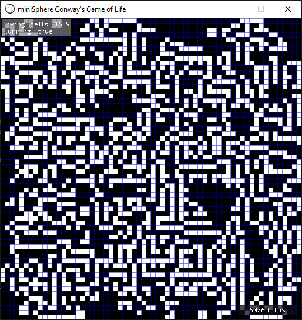

# gameoflife-miniSphere
A (mostly-complete) implementation of Conway's Game of Life in TypeScript using the miniSphere game engine

Cell, miniSphere's build engine doesn't have official TypeScript support yet, so I'm including the `cell` and `typescript` directories until it's added in the next release.

## Keys
* C - Clear the board
* G - Toggle the grid
* R - Randomize the board
* S - Step
* Space: Pause or resume
* Left: Decrease speed
* Right: Increase speed
* Escape: Exit

## Screenshot
